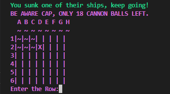

# PirateShip

Pirate ship is a single player game ran through the command line, hosted by Heroku. 

The game uses the code institute python template to create the terminal that the shows the game on the Heroku app.  

The aim of the game is for the player to sink all of the enemy ships before they run out of cannonballs. 

# How to play 

- Read welcome message and rules. 

- Chose your captain's name. 

- Enter co-ordinates of where you think the enemy ships are, for example Row: 1 then column: A

- Aim to destroy all enemy ships before running out of ammo 

- You have 25 Cannon balls to use 

# Features 

-   The first feature the user will see is the welcome message that loads when the application starts. This section also contains the rules and the how to play section. 

    
    

- 	The user will then be asked to enter their chosen username, as this is a required element and must be between 1 and 8 characters long. 
- 	Not entering a username will produce an error and ask for an input. 

    

- 	Once a valid username has been entered, the application will load the game board and ask the player to enter their guess as coordinates. 

     

-   The application will then check the coordinates against the game board and see if the player has made a hit or miss. This will output the result, 
    placing a ~ for a miss or X for a hit on the chosen coordinate. 

     

-   The player has a limited number of guesses, if they do not get all of the ships before they use up all of their guesses or “cannonballs”, they lose. 
    If the player manages to hit all of the enemy ships within their limited turns they win. 

     

-   After the player wins or loses they will be asked if they would like to play again.

    

# Testing

- I ran my code through the PEP8 Python checker and got back no critical errors.

- The code was tested constantly throughout the project both in the gitpod terminal and the Heroku application.

- The application was tested by myself and peers repeatedly.

- There is currently one known bug within the application:
    - When a user doesn't enter anything in the row or column input section it crashes the application.
    - I implemented a ValueError but could not get this to work correctly.

- Other validators such as CSS, HTML and JavaScript are not needed for this project.

# Deploying

## Project Deployment

To deploy the project through Heroku I followed these steps:

- Sign up / Log in to https://www.heroku.com.
- From the main Heroku Dashboard page select 'New' and then 'Create New App'.
- Give the project a name, for example 'pirateships'. This name must be in lower case with no special characters.
- In the config vars section select the reveal config vars button. This will display the current config vars for the app.
- In the KEY input field, enter PORT all in capitals, add the VALUE of 8000 then click the 'add' button.
- Next select the add buildpack button, located below the config vars section.
- In the pop-up window select Python as your first build pack, click save changes then add nodeJS. The build packs MUST be in this order.
- Next, navigate back to the deploy tab using the submenu at the top of the page.
- In the deployment method section, select the GitHubConnect to GitHub button and follow the steps to connect your GitHub account.
- In the Connect to GitHub section that appears, select your account and enter the name of the repository then search.
- Once Heroku has located the repo, select connect.
- This will connect the repo to the app within Heroku.
- You can then choose to automatically deploy after each push you make to GitHub, or you can manually deploy each time you make a push.
- Heroku will now build the app for you. Once it has completed the build process you will see a 'Your App Was Successfully Deployed' message and a link to the app to visit the live wenbsite.

# Credits

- Thank you to the slack community for tips and advice throughout the project.

- Knowledge Mavens on YouTube for the tutorial, that helped to guide me through creating the single player game.

- https://ozzmaker.com/add-colour-to-text-in-python/ for showing me how to add color to my project.
